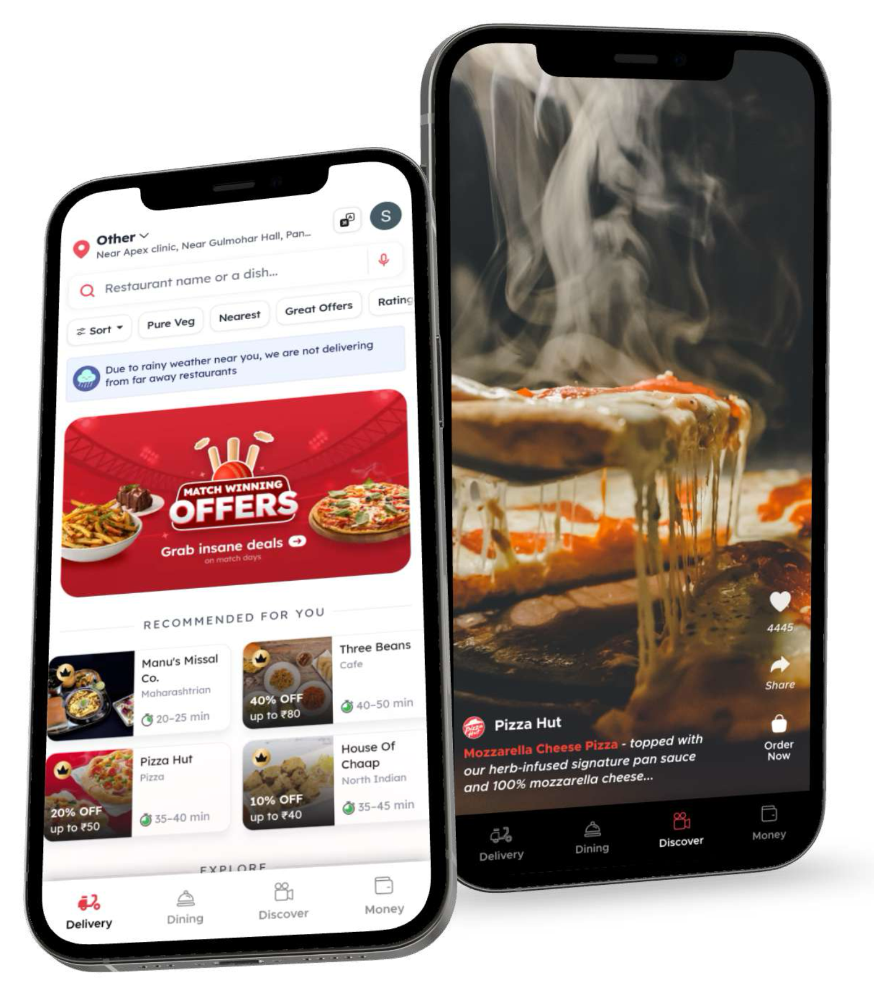

# Zomato Business Model Innovation

## 🚀 Executive Summary
This repository showcases my journey through the **Product Management Fellowship** at Grow Junction. During the fellowship, I acquired fundamental skills required to manage a product lifecycle effectively, from market research to building and scaling a product. The program covered essential modules such as **product strategy**, **user research**, **product roadmap**, **market positioning**, and much more. This repository highlights key learnings, projects, and tools utilized during the program.

The project focuses on analyzing and enhancing Zomato’s business model by identifying customer pain points and providing innovative solutions like the **Discover** feature and **dynamic suggestions**. The analysis leverages frameworks such as **Porter’s 5 Forces** and **market research** to provide actionable strategies to boost user engagement, increase orders, and improve customer experience. Our solutions aim to reduce customer decision time, promote restaurant quality, and create new revenue opportunities.

## 🔑 Company Overview
- **Founded**: 2008
- **Valuation**: $5.48 Billion
- **Revenue (FY22)**: $525 Million
- **IPO**: $1.1 Billion
- **Countries**: 25 countries, 10,000 cities (including India, USA, Australia, Brazil, Singapore)
- **Key Activities**: Restaurant Listings, Food Delivery, Live Events, Zomato Kitchen, Hyperpure, White Label Access
- **Acquisitions**: UberEats, BlinkIt
- **Growth**: 30% annual forecast

## 🛠 Problem Identification
During user research, 30 people were interviewed, and the following key challenges were identified:
- **70% of users** spend **20-30+ minutes** deciding what to order. As a result many don't order at the end.
  
### Key Pain Points:
1. Overwhelming number of restaurants, cuisines, and dishes to choose from.
2. Limited information about restaurants (ratings, reviews, cuisine details).
3. Complex pricing and discount structures.
4. Unpredictable delivery times.

## 💡 Solution Proposals

### 1. **Discover Feature**:
- **Short video content** (similar to Instagram Reels or YouTube Shorts) showcasing different dishes, restaurants, and trending cuisines.
- **Personalized recommendations** based on past orders, popular food, and location trends.
- **Social Sharing**: Users can share recommendations with friends or family.
- **Direct Ordering**: Users can place orders directly from the Discover tab, simplifying the ordering process and reducing decision time.

### 2. **Dynamic Suggestions**:
- **Limited-period coupons**: Create urgency for users to order faster, driving quicker decisions and boosting order volumes.
- **Top 3 Restaurants in Your Area**: Highlight trending restaurants, encouraging them to maintain high-quality service to stay featured, thereby enhancing the overall customer experience.

## 📊 Competitive Analysis - Porter’s 5 Forces

1. **Threat of Entry**: Low
   - Highly consolidated market: Swiggy and Zomato dominate 90% of the market.
   - High entry barriers due to tech infrastructure, resources, and restaurant partnerships.
   - Aggressive pricing from incumbents.

2. **Bargaining Power of Suppliers**: Low to Medium
   - Suppliers: Restaurants and cloud kitchens depend on platforms like Zomato for customer reach.
   - Some cloud kitchens rely exclusively on food delivery apps.
   - A large supplier base reduces individual bargaining power.

3. **Competitive Rivalry**: High
   - Few major players (Swiggy, Zomato).
   - Unique features are easily replicated, increasing competition.
   - High marketing and onboarding costs due to similar UI/UX across platforms.

4. **Threat of Substitutes**: High
   - Food carts, small restaurants, and street vendors offer cheaper alternatives.
   - Substitutes are readily available in every locality with faster service times.

5. **Bargaining Power of Buyers**: High
   - Buyers have many choices across apps with similar pricing and features.
   - Users switch easily between apps based on promotions or discounts.

## 🌍 Market Size

- **TAM (Total Addressable Market)**: $16.25 Billion (Online Food Delivery in India).
- **SAM (Serviceable Available Market)**: $3.25 Billion (20% of TAM).
- **SOM (Serviceable Obtainable Market)**: $1.3 Billion (40% of SAM).

## 💼 Revenue Model & Pricing

1. **Restaurant Listings & Advertising**: Restaurants can advertise and sponsor listings on Zomato’s platform to gain visibility.
2. **Food Delivery Fees**: Zomato charges restaurants a commission of 20-25% per order (location-dependent).
3. **Subscription Programs**: Zomato Gold provides exclusive discounts and benefits for subscribers.
4. **Live Events**: Zomato’s venture into live events with Zomaland offers additional revenue streams through partnerships with restaurants.
5. **White Label Solutions**: Zomato offers customized delivery apps for businesses under Zomato Whitelabel.

## 🚀 Launch Strategy

1. **Beta Testing**: Testing new features with a small group to gather feedback and optimize the product.
2. **Soft Launch**: Rolling out products in specific markets to control feedback and fine-tune the feature before broader release.
3. **Viral Marketing**: Use of viral videos and social media to generate buzz around new features.
4. **Partnerships**: Collaborations with companies like Uber and InMobi to expand service offerings and reach.

## 💻 Architecture

1. **Platform Scalability**: Cloud infrastructure, distributed databases, and load balancers to manage millions of transactions.
2. **Recommendation Engine**: Machine learning algorithms to deliver personalized recommendations based on user behavior and preferences.
3. **Mobile Optimization**: Optimized mobile applications for seamless iOS and Android experiences.
4. **Payment Gateways**: Integration with platforms like Razorpay, Paytm, and LazyPay for smooth transactions.
5. **Logistics & Delivery**: Real-time tracking for efficient food delivery.
6. **Analytics**: Tools to track user behavior, orders, and performance metrics.

## 📋 Business Model Canvas Overview
- **Key Partners**: Restaurants, Delivery Personnel, Users/Customers, Reviewers
- **Key Activities**: Search services, tech infrastructure, marketing, order fulfillment, restaurant information
- **Key Resources**: Large restaurant database, user base, presence in 25 countries, delivery network
- **Customer Segments**: Users searching for restaurants, preferring home delivery, restaurants wanting to advertise, non-delivery restaurants, cloud kitchens
- **Cost Structure**: Platform development, marketing, processing fees, employee salaries, legal fees
- **Revenue Streams**: Restaurant listings, Zomato Gold, food delivery fees, consultancy, live events, Zomato Kitchen

## 🛠 Tools and Platform Used
- **Figma**: For creating UX/UI prototypes.
- **Google Sheets**: For market research and analysis.
- **Miro**: For visualizing product strategies using the Business Model Canvas.
- **Trello**: Task management and product roadmap.
 
## 🏗 Future Work
- **Scaling the Discover Feature**: Integrate video content more deeply into the app for food discovery.
- **Expand Dynamic Suggestions**: Use machine learning for more personalized recommendations and limited-time offers.
- **Global Partnerships**: Continue building partnerships with global brands and local restaurants to enhance revenue streams.
